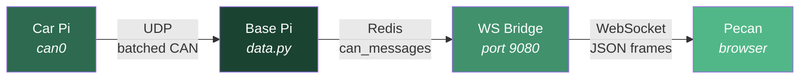
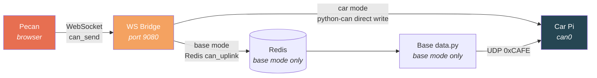
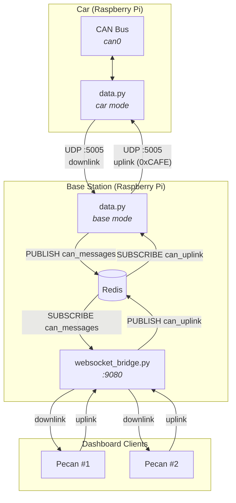
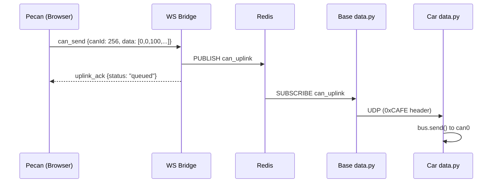
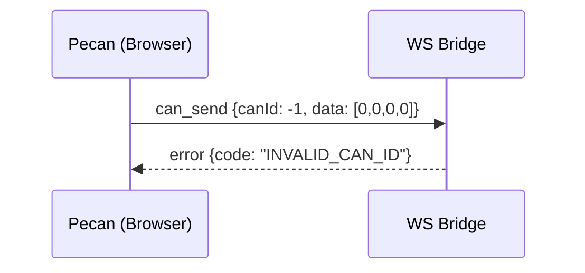

# WFR Telemetry WebSocket Protocol v2 (Bidirectional)

## 1. Overview

This is the canonical WebSocket protocol document for **Pecan** and the **Universal Telemetry Software** (UTS) WebSocket bridge. UTS uses the same Python codebase in both roles: the car runs it natively through `car-telemetry.service`, while the base station runs it through Docker Compose. Protocol v2 adds client-to-car (uplink) messaging alongside the existing car-to-client (downlink) telemetry stream.

The component-local runtime notes live at [`universal-telemetry-software/WEBSOCKET_RUNTIME_NOTES.md`](./universal-telemetry-software/WEBSOCKET_RUNTIME_NOTES.md) so this file remains the only protocol spec.

### 1.1 Architecture Context

**Downlink (Car -> Client):**



**Uplink (Client -> Car):**



**Full Bidirectional System:**



### 1.2 Terminology

| Term | Definition |
|------|-----------|
| **Downlink** | Car-to-client direction. Telemetry data flowing from the vehicle to dashboard viewers. |
| **Uplink** | Client-to-car direction. Commands/messages flowing from the dashboard to the vehicle. |
| **Pecan** | The web-based dashboard (React/TypeScript). Acts as a WebSocket client. |
| **UTS** | Universal Telemetry Software. Shared Python codebase used by both car and base roles. |
| **WS Bridge** | The WebSocket server component inside UTS (`websocket_bridge.py`, port 9080). |
| **CAN frame** | A Controller Area Network message with an arbitration ID (11-bit or 29-bit) and up to 8 data bytes. |

---

## 2. Transport

- **Protocol:** WebSocket (RFC 6455)
- **Port:** `9080` (plain) / `9443` (TLS-terminated)
- **Frame type:** Text frames (JSON)
- **Encoding:** UTF-8
- **Max message size:** no application-level limit is configured; the effective ceiling is the `websockets` library's default (1 MiB) since neither `websocket_bridge.py` nor `broadcast_server.py` pass a `max_size` argument

### 2.1 Connection URL

```
ws://<host>:9080    # local / car hotspot
wss://<host>:9443   # production with TLS
```

Connection negotiation follows standard WebSocket handshake. No subprotocol or custom headers are required.

---

## 3. Message Envelope

All messages in **both directions** use a JSON envelope with a `type` field for disambiguation:

```jsonc
{
  "type": "<message_type>",
  // ... type-specific fields
}
```

### 3.1 Legacy Compatibility

Downlink messages sent **without** a `type` field are treated as legacy v1 messages:
- A JSON **array** is interpreted as a CAN message batch (`can_data`)
- A JSON **object** with a `received` key is interpreted as system stats (`system_stats`)

Clients SHOULD send enveloped messages. The server MUST accept both enveloped and legacy formats.

---

## 4. Downlink Messages (Server -> Client)

These messages flow from the WebSocket bridge to connected Pecan clients.

### 4.1 `can_data` — CAN Telemetry Batch

Batched CAN frames from the vehicle. Published at ~20 msgs / 50ms from the base station.

```jsonc
// Enveloped (v2)
{
  "type": "can_data",
  "messages": [
    {
      "time": 1708012800000,   // Unix timestamp in milliseconds
      "canId": 256,            // CAN arbitration ID (decimal)
      "data": [146, 86, 42, 123, 205, 255, 0, 0]  // 0-8 data bytes
    }
    // ... more messages
  ]
}

// Legacy (v1) — still supported
[
  { "time": 1708012800000, "canId": 256, "data": [146, 86, 42, 123, 205, 255, 0, 0] }
]
```

| Field | Type | Required | Description |
|-------|------|----------|-------------|
| `type` | `"can_data"` | Yes (v2) | Message discriminator |
| `messages` | `array` | Yes | Array of CAN message objects |
| `messages[].time` | `number` | Yes | Timestamp in ms since Unix epoch |
| `messages[].canId` | `number` | Yes | CAN arbitration ID (0–2047 standard, 0–536870911 extended) |
| `messages[].data` | `number[]` | Yes | Data bytes array, length 0–8, each value 0–255 |

### 4.2 `system_stats` — System Statistics

Published once per second by the base station.

```jsonc
// Enveloped (v2)
{
  "type": "system_stats",
  "received": 45,
  "missing": 1,
  "recovered": 0
}

// Legacy (v1) — still supported
{ "received": 45, "missing": 1, "recovered": 0 }
```

| Field | Type | Required | Description |
|-------|------|----------|-------------|
| `type` | `"system_stats"` | Yes (v2) | Message discriminator |
| `received` | `number` | Yes | UDP packets received this second |
| `missing` | `number` | Yes | UDP packets detected missing this second |
| `recovered` | `number` | Yes | Packets recovered via TCP this second |

### 4.3 `uplink_ack` — Uplink Acknowledgement

Sent in response to an uplink `can_send` message to confirm receipt and processing.

```jsonc
{
  "type": "uplink_ack",
  "ref": "abc-123",           // Echo of the client's ref ID
  "status": "queued",         // "queued" in base mode, "sent" in car mode
  "reason": null              // null on success, string on rejection
}
```

| Field | Type | Required | Description |
|-------|------|----------|-------------|
| `type` | `"uplink_ack"` | Yes | Message discriminator |
| `ref` | `string` | Yes | Echo of the client-provided reference ID |
| `status` | `string` | Yes | `"queued"` = accepted by base mode for Redis/UDP relay, `"sent"` = written directly in car mode |
| `reason` | `string\|null` | No | Human-readable rejection reason |

### 4.4 `error` — Server Error

Sent when the server encounters an error processing a client message.

```jsonc
{
  "type": "error",
  "code": "INVALID_MESSAGE",
  "message": "Missing required field: canId"
}
```

| Field | Type | Required | Description |
|-------|------|----------|-------------|
| `type` | `"error"` | Yes | Message discriminator |
| `code` | `string` | Yes | Machine-readable error code (see section 7) |
| `message` | `string` | Yes | Human-readable description |

### 4.5 `page_lock_state` — Page Lock Snapshot

Broadcast to all clients whenever a page lock changes (acquired/released), and sent to a single client in response to an uplink `page_lock` query (§5.4).

```jsonc
{
  "type": "page_lock_state",
  "locks": {
    "can-transmitter": { "holder": "client-abc", "name": "Alice" }
  },
  "clientId": "client-abc"          // only present on a direct query response
}
```

| Field | Type | Required | Description |
|-------|------|----------|-------------|
| `type` | `"page_lock_state"` | Yes | Message discriminator |
| `locks` | `object` | Yes | Map of locked page name -> `{holder, name}`. Pages with no active lock are omitted. |
| `clientId` | `string` | No | This client's own connection id; only included on a direct `query` response |

### 4.6 `page_lock_result` — Page Lock Acquire Result

Sent to the requesting client in response to an uplink `page_lock` acquire.

```jsonc
{
  "type": "page_lock_result",
  "page": "can-transmitter",
  "success": false,
  "holder": "client-xyz",
  "name": "Bob"
}
```

| Field | Type | Required | Description |
|-------|------|----------|-------------|
| `type` | `"page_lock_result"` | Yes | Message discriminator |
| `page` | `string` | Yes | The page name the client tried to lock |
| `success` | `boolean` | Yes | Whether the lock was granted |
| `clientId` | `string` | No | Present on success; this client's connection id |
| `holder` | `string` | No | Present on failure; the connection id currently holding the lock |
| `name` | `string` | No | Present on failure; display name of the current holder |

### 4.7 Link Diagnostics (`link_diagnostics` channel passthrough)

The base station's WebSocket bridge subscribes to the `link_diagnostics` Redis channel (published by `src/link_diagnostics.py`) and forwards every message straight to connected clients, unmodified. Three `type` values are published on this channel:

```jsonc
{ "type": "ping", "rtt_ms": 23.4, "ts": 1732650000000 }
{ "type": "throughput", "mbps": 41.2, "loss_pct": 0.0, "sent": 200, "received": 200, "ts": 1732650000000 }
{ "type": "radio", "rssi_dbm": -62, "tx_mbps": 130.0, "rx_mbps": 86.0, "ccq_pct": 92.5, "ts": 1732650000000 }
```

| Field | Type | Description |
|-------|------|-------------|
| `type` | `"ping" \| "throughput" \| "radio"` | Diagnostic message discriminator — **note this `"ping"` is unrelated to the client-initiated uplink `ping` in §5.3; it is a server-side ICMP RTT sample forwarded downlink.** |
| `rtt_ms` | `number\|null` | (`ping`) Round-trip time to the car, or `null` if unreachable |
| `mbps` / `loss_pct` / `sent` / `received` | `number` | (`throughput`) Periodic UDP throughput burst test results |
| `rssi_dbm` / `tx_mbps` / `rx_mbps` / `ccq_pct` | `number` | (`radio`) Scraped from the Ubiquiti radio's status page; may be replaced by an `error` field instead if the scrape fails |
| `ts` | `number` | Epoch milliseconds |

---

## 5. Uplink Messages (Client -> Server)

These messages flow from Pecan clients to the WebSocket bridge, which relays them toward the car.

### 5.1 `can_send` — Send CAN Message to Vehicle

Request the car to write a CAN frame to the bus.

```jsonc
{
  "type": "can_send",
  "ref": "abc-123",
  "canId": 256,
  "data": [0, 0, 100, 0, 0, 0, 0, 0]
}
```

| Field | Type | Required | Description |
|-------|------|----------|-------------|
| `type` | `"can_send"` | Yes | Message discriminator |
| `ref` | `string` | Yes | Client-generated unique reference ID for tracking (UUID recommended) |
| `canId` | `number` | Yes | CAN arbitration ID to transmit (0–2047 standard, 0–536870911 extended) |
| `data` | `number[]` | Yes | Data bytes to send, length 1–8, each value 0–255 |

**Validation rules:**
- `canId` must be a non-negative integer
- `data` must be a non-empty array of 1–8 integers, each in range [0, 255]
- `ref` must be a non-empty string (max 64 characters)

**Server behavior:**
1. Validate the message
2. If invalid, respond with `error` and close processing
3. If running in car mode, write directly to `can0` with `python-can`
4. If running in base mode, publish to Redis channel `can_uplink` for UDP relay to the car
5. Respond with `uplink_ack` (`"sent"` in car mode, `"queued"` in base mode)

### 5.2 `can_send_batch` — Send Multiple CAN Messages

Batch variant for sending multiple CAN frames in a single WebSocket message.

```jsonc
{
  "type": "can_send_batch",
  "ref": "batch-456",
  "messages": [
    { "canId": 256, "data": [0, 0, 100, 0, 0, 0, 0, 0] },
    { "canId": 192, "data": [1, 0, 0, 0, 0, 0, 0, 0] }
  ]
}
```

| Field | Type | Required | Description |
|-------|------|----------|-------------|
| `type` | `"can_send_batch"` | Yes | Message discriminator |
| `ref` | `string` | Yes | Client-generated unique reference ID |
| `messages` | `array` | Yes | Array of CAN message objects (max 20 per batch) |
| `messages[].canId` | `number` | Yes | CAN arbitration ID |
| `messages[].data` | `number[]` | Yes | Data bytes, 1–8 values in [0, 255] |

### 5.3 `ping` — Keepalive / Latency Check

```jsonc
{
  "type": "ping",
  "timestamp": 1708012800000
}
```

Server responds with:

```jsonc
{
  "type": "pong",
  "timestamp": 1708012800000,    // Echo of client's timestamp
  "serverTime": 1708012800005    // Server's current time
}
```

### 5.4 `page_lock` — Acquire/Release/Query a Page Lock

Lets a client claim exclusive editing rights to a sensitive page (e.g. the CAN transmitter or throttle mapper) so two teammates don't send conflicting commands at once.

```jsonc
{ "type": "page_lock", "action": "acquire", "page": "can-transmitter", "name": "Alice" }
{ "type": "page_lock", "action": "release", "page": "can-transmitter" }
{ "type": "page_lock", "action": "query" }
```

| Field | Type | Required | Description |
|-------|------|----------|-------------|
| `type` | `"page_lock"` | Yes | Message discriminator |
| `action` | `"acquire" \| "release" \| "query"` | Yes | Requested operation |
| `page` | `string` | For `acquire`/`release` | Must be one of the server's allow-listed page names (currently `can-transmitter`, `throttle-mapper`) |
| `name` | `string` | No | Display name shown to other clients while the lock is held (max 50 chars) |

Server responds with `page_lock_result` (§4.6) for `acquire`, and `page_lock_state` (§4.5) for `query`; a successful `acquire`/`release` also triggers a `page_lock_state` broadcast to all clients. An unknown `page` or `action` returns an `error` with code `INVALID_PAGE` or `INVALID_ACTION` respectively (see §7).

---

## 6. Deployment Modes and Redis Channels

The WebSocket bridge runs the same protocol in both UTS roles, but the uplink path differs:

| Mode | `ROLE` | Uplink path | Redis required for uplink? |
|------|--------|-------------|----------------------------|
| Car direct | `car` | Browser -> WebSocket bridge -> `python-can` -> `can0` | No |
| Base station | `base` | Browser -> WebSocket bridge -> Redis `can_uplink` -> UDP `0xCAFE` relay -> car | Yes |

In car mode, downlink frames can also be broadcast from an in-process queue, so Redis is not required on the car. In base mode, the WebSocket bridge uses Redis pub/sub as the message bus between components.

| Channel | Direction | Publisher | Subscriber | Format |
|---------|-----------|-----------|------------|--------|
| `can_messages` | Downlink | Base `data.py` | WS Bridge | JSON array of `{time, canId, data}` |
| `system_stats` | Downlink | Base `data.py` | WS Bridge | JSON object `{received, missing, recovered}` |
| `can_uplink` | Uplink | WS Bridge | Base `data.py` | JSON object (see below) |
| `link_diagnostics` | Downlink | Base `link_diagnostics.py` | WS Bridge | JSON object, forwarded as-is to clients (see §4.7) |
| `telemetry_heartbeat` | Downlink | Base `data.py`/`heartbeat.py` | WS Bridge (filtered, not forwarded to clients) | Internal liveness signal |

### 6.1 `can_uplink` Channel Format

```jsonc
{
  "ref": "abc-123",
  "canId": 256,
  "data": [0, 0, 100, 0, 0, 0, 0, 0],
  "source": "192.168.1.5:54321",   // Client IP:port for auditing
  "timestamp": 1708012800000       // Server receipt time
}
```

For batch messages, each CAN frame in the batch is published as a separate Redis message to `can_uplink`, all sharing the same `ref` prefix (e.g., `batch-456/0`, `batch-456/1`).

---

## 7. Error Codes

| Code | Description |
|------|-------------|
| `INVALID_MESSAGE` | JSON parse error or missing `type` field |
| `INVALID_CAN_ID` | `canId` out of range or not an integer |
| `INVALID_DATA` | `data` array invalid (wrong length, values out of range) |
| `INVALID_REF` | `ref` missing or exceeds 64 characters |
| `BATCH_TOO_LARGE` | `can_send_batch` exceeds 20 messages |
| `RATE_LIMITED` | Client is sending uplink messages too fast |
| `UPLINK_DISABLED` | Uplink is not enabled on this server instance |
| `UNKNOWN_TYPE` | Unrecognized message `type` |
| `CAN_WRITE_FAILED` | Car mode only: `python-can` failed to write to `can0` |
| `INVALID_PAGE` | `page_lock` targets a page not in the server's allow-list |
| `INVALID_ACTION` | `page_lock` action is not `acquire`, `release`, or `query` |

---

## 8. Rate Limiting

To protect the CAN bus from being flooded:

| Limit | Value | Scope |
|-------|-------|-------|
| Max uplink messages/sec | 10 | Per client connection |
| Max batch size | 20 | Per `can_send_batch` message |
| Max message size | 64 KB | Per WebSocket frame |

When rate limited, the server responds with:

```jsonc
{
  "type": "error",
  "code": "RATE_LIMITED",
  "message": "Uplink rate limit exceeded (max 10 msg/sec)"
}
```

---

## 9. Car-Side Uplink Processing

There are two valid car-side uplink paths:

- Direct car connection: the car-mode WebSocket bridge writes `can_send` and `can_send_batch` messages directly to `can0`.
- Base station relay: the base-mode WebSocket bridge publishes to Redis, `data.py` relays the message over UDP, and the car receives a `0xCAFE` uplink packet.

When the car-side UTS receives a UDP uplink packet from the base station, it:

1. Deserializes the JSON payload
2. Validates the CAN frame shape
3. Constructs a `python-can` `Message` object
4. Writes to `can0` via `bus.send(msg)`

### 9.1 UDP Uplink Packet Format

The base station relays uplink CAN messages to the car using the same UDP channel but with a distinct packet header:

```
Uplink UDP Packet:
  [0:2]   Magic bytes: 0xCA 0xFE  (distinguishes uplink from downlink)
  [2:10]  Sequence number (uint64, big-endian)
  [10:12] Message count (uint16, big-endian)
  [12:..] CAN messages, each 20 bytes:
            [0:8]   Timestamp (double, big-endian)
            [8:12]  CAN ID (uint32, big-endian)
            [12:20] Data (8 bytes, zero-padded)
```

The car-side distinguishes uplink packets from its own outbound packets by checking for the `0xCAFE` magic prefix.

---

## 10. Security Considerations

### 10.1 CAN Bus Safety

Sending arbitrary CAN messages to a vehicle is **inherently dangerous**. Malformed messages can:
- Trigger unintended actuator responses
- Corrupt ECU state
- Violate FSAE safety rules

**Current safeguards:**
- Uplink is **disabled by default** (requires `ENABLE_UPLINK=true` env var)
- Rate limiting is enforced at the WebSocket bridge level
- All uplink messages are logged with client IP and timestamp for auditing

**Recommended future safeguards:**
- Restrict uplink CAN IDs to an allowlist derived from the DBC or a dedicated safety config
- Require authentication for uplink-capable WebSocket connections

### 10.2 Authentication

The current system does not authenticate WebSocket clients. For uplink functionality:
- Restrict WebSocket access to the local network (car hotspot / pit LAN)
- Consider adding a shared secret or token for uplink messages in future versions

---

## 11. Implementation Checklist

### WebSocket Bridge (`websocket_bridge.py`)
- [x] Accept and parse client messages (replaced `websocket.wait_closed()` with `async for`)
- [x] Validate uplink message structure
- [x] Publish valid `can_send` messages to Redis `can_uplink` channel
- [x] Send `uplink_ack` responses
- [x] Send `error` responses for invalid messages
- [x] Implement rate limiting per client
- [x] Handle `ping`/`pong`
- [x] Gate uplink behind `ENABLE_UPLINK` env var

### Base Station (`data.py`)
- [x] Subscribe to Redis `can_uplink` channel
- [x] Relay uplink messages to car via UDP (with `0xCAFE` header)

### Car (`data.py`)
- [x] Listen for inbound UDP uplink packets (detect `0xCAFE` magic)
- [x] Write received CAN frames to `can0`

### Pecan Client (`WebSocketService.ts`)
- [x] Add `sendCanMessage()` method for uplink messages
- [x] Add `sendCanBatch()` method
- [x] Handle `uplink_ack` and `error` responses
- [x] Generate unique `ref` IDs
- [x] Handle `pong` responses for latency measurement

---

## 12. Example Flows

### 12.1 Sending a Torque Request from Dashboard



### 12.2 Error: Invalid CAN ID



---

## Appendix A: CAN IDs Reference (from `server/installer/example.dbc`)

There are two different `example.dbc` files in this repo — this table matches `server/installer/example.dbc`. `universal-telemetry-software/example.dbc` and `car-simulate/example.dbc` (byte-identical to each other) instead use `M192_Command_Message`/`BMS_Current_Limit`/`TORCH_*`-style names; consult that file directly if you're working with the UTS/car-simulate stack instead of the server stack.

| CAN ID | Name | Direction | Description |
|--------|------|-----------|-------------|
| 192 | VCU_Status | Downlink | Vehicle Control Unit status |
| 193 | Pedal_Sensors | Downlink | APPS and brake pressure |
| 194 | Steering_Wheel | Downlink | Steering angle and buttons |
| 256 | MC_Command | **Uplink candidate** | Torque request to motor controller |
| 257 | MC_Feedback | Downlink | Motor speed, torque, current |
| 512 | BMS_Status | Downlink | Pack voltage, current, SOC |
| 513 | BMS_Cell_Stats | Downlink | Cell voltage statistics |
| 768 | Wheel_Speeds | Downlink | Four wheel speed sensors |
| 1024 | IMU_Data | Downlink | Accelerometer and gyro |
| 1280 | Cooling_Status | Downlink | Coolant temps, pump/fan speed |

---

## Appendix B: Migration from v1

v1 clients (those that never send messages and only consume downlink data) require **zero changes**. The server continues to broadcast legacy un-enveloped messages on the `can_messages` and `system_stats` Redis channels.

Clients may send typed v2 uplink/control messages such as:

```jsonc
{ "type": "ping", "timestamp": 1708012800000 }
```

The server accepts `subscribe` as a no-op reserved message type for future compatibility, but it does not currently switch downlink clients into a different envelope format.
