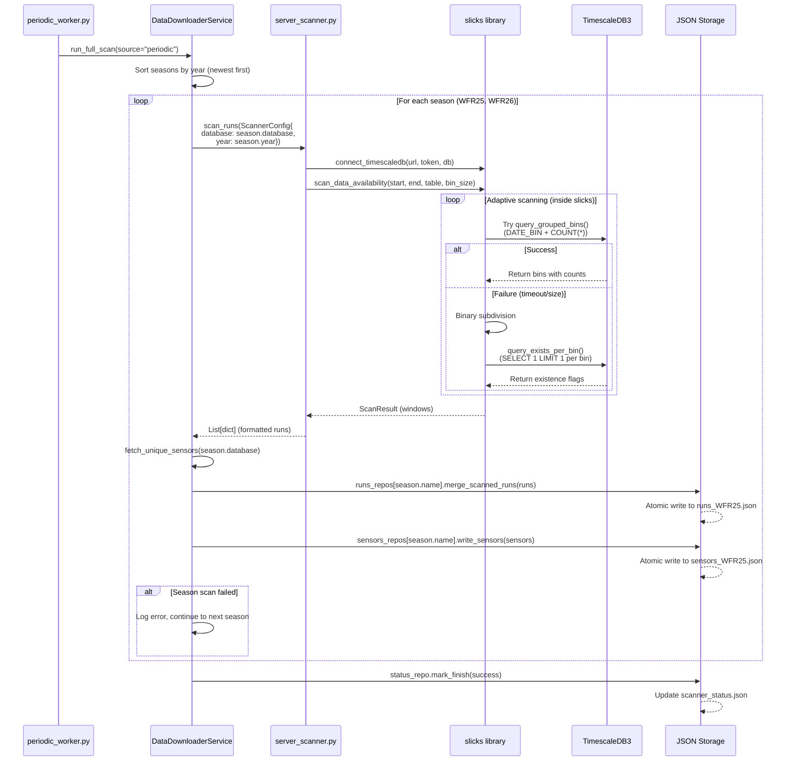
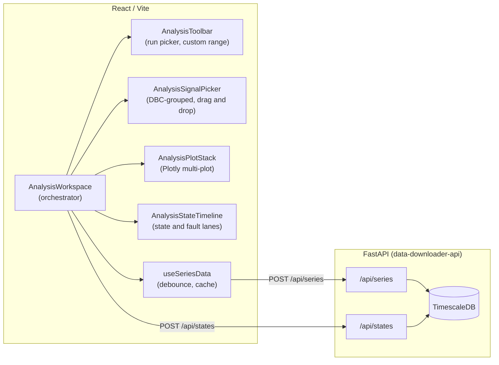

# Data Downloader Webapp

This project packages the DAQ data-downloader experience into a small stack:

- **React frontend** (`frontend/`) for browsing historic runs, triggering scans, and annotating runs.
- **FastAPI backend** (`backend/`) that reads/writes JSON state, exposes REST endpoints, and can launch scans on demand.
- **Scanner worker** (separate Docker service) that periodically runs the TimescaleDB availability scan plus the unique sensor collector and exports the results to `data/runs.json` and `data/sensors.json`.

Both JSON files are shared through the `./data` directory so every service (frontend, API, scanner) sees the latest state. Notes added in the UI are stored in the same JSON payload next to the run entry.

## Getting started

1. Duplicate the sample env file and fill in the TimescaleDB credentials:
   ```bash
   cp .env.example .env
   ```
2. Build + launch everything:
   ```bash
   docker compose up --build
   ```
3. Open http://localhost:3000 to access the web UI, and keep the API running on http://localhost:8000 if you want to call it directly.

## Runtime behaviour


- `frontend` serves the compiled React bundle via nginx and now proxies `/api` requests (including `/api/scan` and `/api/scanner-status`) directly to the FastAPI container. When the UI is loaded from anything other than `localhost`, the client automatically falls back to relative `/api/...` calls so a single origin on a VPS still reaches the backend. Override `VITE_API_BASE_URL` if you want the UI to talk to a different host (for example when running `npm run dev` locally) and keep that host in `ALLOWED_ORIGINS`.
- `api` runs `uvicorn backend.app:app`, exposing
  - `GET /api/runs` and `GET /api/sensors`
  - `POST /api/runs/{key}/note` to persist notes per run
  - `POST /api/scan` to fire an on-demand scan that refreshes both JSON files in the background
  - `POST /api/data/query` to request a timeseries slice for a given `signalName` between two timestamps; the response echoes the exact SQL (matching `sql.py`) so the frontend can display the query being executed.
- `scanner` reuses the same backend image but runs `python -m backend.periodic_worker` so the scan + unique sensor collection happens at the interval defined by `SCAN_INTERVAL_SECONDS`.

Set `POSTGRES_DSN` and `DEFAULT_SEASON_TABLE` to match your deployment so the SQL sent from `backend/server_scanner.py` and `backend/sql.py` queries the correct season table.

All services mount `./data` inside the container and the FastAPI layer manages file I/O with atomic writes to keep data consistent between the worker and UI actions. If the rolling lookback produces no sensors, the collector now falls back to the oldest/newest run windows discovered by the date scanner, so no manual date tuning is required.

---

## Analysis workspace

The Analysis tab is a post-session analytics workspace that lives alongside the existing Past Runs tab in the frontend. It queries TimescaleDB for signal time-series and vehicle state data, renders interactive multi-plot Plotly charts, and provides CSV export.

### What it does

- Plots one or more CAN signals on interactive Plotly charts within a run time window.
- Adapts query density to the time range: raw samples for short windows, time-bucketed min/max/avg envelopes for wide windows.
- Groups signals into separate plots with independent dual Y-axes, persisted per season in `localStorage`.
- Renders a vehicle state timeline below the plots showing VCU state, inverter VSM state, and PM100 fault intervals decoded from the CAN bitfields.
- Exports visible series data to CSV.

### Architecture



### Query pipeline

1. The user selects a run (or enters a custom range) in the toolbar and picks signals from the signal picker.
2. `AnalysisWorkspace` flattens the current plot layout into a deduplicated signal list and passes the range and signals to `useSeriesData`.
3. `useSeriesData` debounces requests by 300 ms, checks a client-side LRU cache (1 M point budget), and calls `POST /api/series`.
4. The backend validates the request, estimates total row count via TimescaleDB `approximate_row_count` or `COUNT(*)`, then runs a raw query or a `time_bucket` envelope query depending on density. A `SET LOCAL statement_timeout = 15000` guard prevents runaway queries.
5. The frontend renders one Plotly chart per plot group, with linked x-axes so zoom on one chart zooms all charts.
6. State timeline data is fetched once per run window (not refetched on zoom) via `POST /api/states`.

### Density modes

| Mode | Condition | Columns returned |
|------|-----------|------------------|
| `raw` | estimated rows per signal < 100 000 | `t`, `v` |
| `envelope` | estimated rows per signal >= 100 000 | `t`, `min`, `max`, `avg` |

The `target_points` parameter (default 4 000, max 20 000) controls the bucket count in envelope mode. The client auto-scales `target_points` based on the number of selected signals to stay within a shared 1 M point budget.

---

## Analytics API endpoints

These are the endpoints added by the analytics feature. The existing downloader endpoints (`/api/runs`, `/api/sensors`, `/api/query`, etc.) are unchanged.

### POST /api/series

Returns time-series data for one or more signals within a time window.

Request body:

```json
{
  "season": "wfr26",
  "signals": ["Motor_Speed", "Motor_Temp"],
  "start": "2026-05-10T14:00:00Z",
  "end": "2026-05-10T14:30:00Z",
  "target_points": 4000
}
```

Response shape:

```json
{
  "season": "wfr26",
  "start": "2026-05-10T14:00:00+00:00",
  "end": "2026-05-10T14:30:00+00:00",
  "series": {
    "Motor_Speed": {
      "mode": "raw",
      "resolution_ms": null,
      "point_count": 1200,
      "t": [1715349600000],
      "v": [3200.5]
    }
  }
}
```

Envelope mode returns `min`, `max`, `avg` arrays instead of `v`.

Limits:

| Parameter | Constraint |
|-----------|------------|
| `signals` | 1 to 12, unique, valid identifiers |
| `target_points` | 1 to 20 000 |
| Time window | max 7 days |
| Projected total points | max 1 500 000 (rejected before fetch) |

### POST /api/states

Returns vehicle state lane segments and decoded PM100 fault intervals.

Request body:

```json
{
  "season": "wfr26",
  "start": "2026-05-10T14:00:00Z",
  "end": "2026-05-10T14:30:00Z"
}
```

Response shape:

```json
{
  "season": "wfr26",
  "start": "...",
  "end": "...",
  "lanes": [
    {
      "id": "car",
      "signal": "State",
      "label": "Car",
      "segments": [
        { "start_ms": 0, "end_ms": 5000, "value": 4, "label": "DRIVE" }
      ]
    }
  ],
  "faults": [
    {
      "name": "Over-current Fault",
      "source": "run",
      "segments": [{ "start_ms": 4000, "end_ms": 4100 }]
    }
  ]
}
```

State lanes are derived by detecting value transitions with a 5-second gap tolerance. Labels come from the DBC `VAL_` definitions when available. Fault segments are decoded from the PM100 `INV_Post_Fault_Lo/Hi` and `INV_Run_Fault_Lo/Hi` bitfields using the Cascadia Motion CAN protocol fault name tables.

---

## Analytics frontend structure

```
frontend/src/
├── analysis/
│   ├── analysis-range.ts        Run-to-millisecond conversion, cross-season overlap
│   ├── export-csv.ts            Series-to-CSV conversion and download trigger
│   ├── plot-layout.ts           Pure model: groups, signal toggling, assignment, dual axis
│   ├── plot-traces.ts           Plotly trace and layout builders for raw/envelope data
│   ├── series-cache.ts          LRU cache with a shared 1M point budget
│   ├── state-timeline.ts        Severity classification, segment box geometry, formatting
│   └── use-series-data.ts       React hook: debounced fetch, cache, retry, clear
├── components/
│   ├── AnalysisWorkspace.tsx     Top-level orchestrator (range, signals, fetch, state)
│   ├── AnalysisToolbar.tsx       Run picker, custom range inputs, export button
│   ├── AnalysisSignalPicker.tsx  DBC-grouped signal list, click/drag to assign
│   ├── AnalysisPlotStack.tsx     Plotly multi-plot renderer with drop targets
│   ├── AnalysisStateTimeline.tsx Collapsible state and fault lane visualization
│   ├── PlotAssignMenu.tsx        Accessible combobox for plot reassignment
│   └── sensor-palette.ts        DJB2-hashed subsystem color palette
└── types.ts                     Shared TypeScript interfaces
```

All pure logic modules under `analysis/` are side-effect-free and fully unit-tested. Component modules handle rendering, user interaction, and DOM integration.

### State management

Plot layout (which signals belong to which plot, right-axis assignments) is persisted to `localStorage` keyed by season name. On mount, persisted signals are pruned against the season's known signal list to avoid stale references. The layout is serialized after every toggle, assignment, or drag-and-drop.

The state timeline collapse flag is also stored in `localStorage`.

---

## Analytics backend structure

```
backend/
├── series_queries.py      Validation, density estimation, raw/envelope SQL, point budget
├── state_queries.py        State lane assembly, PM100 fault bitfield decoding
├── dbc_utils.py            DBC loading, signal grouping, signal_choices() for VAL_ labels
├── app.py                  FastAPI routes including /api/series and /api/states
└── tests/
    ├── test_series_queries.py             12 tests: validation, SQL, envelope shaping
    ├── test_series_endpoint.py            4 tests: happy path, errors, 503
    ├── test_state_queries.py              20 tests: segments, gaps, seeds, fault decode
    ├── test_states_endpoint.py            4 tests: happy path, unknown table, bad window
    └── test_compose_api_env_allowlist.py  Compose env hygiene
```

### State query internals

The state query pipeline avoids returning one row per CAN sample. Instead it:

1. Queries value transitions using `LAG()` window functions with a configurable gap threshold (5 seconds).
2. Seeds the initial state from a 1-hour lookback before the window start.
3. Assembles transitions into contiguous segments, splitting on value changes and time gaps.
4. Labels segments using DBC `VAL_` choice maps when available, falling back to numeric values.
5. Decodes PM100 fault registers by scanning the 32-bit `Post_Fault` and `Run_Fault` words for set bits and mapping them to named faults via the Cascadia Motion fault tables.
6. Merges overlapping fault intervals from the same named fault across multiple registers.

The result is a few kilobytes per lane regardless of window length.

---

## Testing

### Backend

```bash
cd server/installer/data-downloader
.venv/bin/python -m pytest backend/tests/ -v
```

48 tests covering series query validation, SQL generation, envelope shaping, state segment assembly (value changes, gap detection, seed injection), PM100 fault decoding (hi/lo word, reserved bits), interval merging, and endpoint integration.

### Frontend

```bash
cd server/installer/data-downloader/frontend
npx vitest run
```

130 tests across 14 files covering all pure logic modules and every analysis component. Key coverage areas:

- **AnalysisWorkspace** (21 tests) -- tab switching, season remount, persistence/pruning, refresh overlays, export guards, state timeline wiring, zoom interaction, error recovery
- **useSeriesData** (13 tests) -- debounce, cache hits, error handling, retry, clear
- **plot-traces** (12 tests) -- raw and envelope trace building, relayout parsing, axis configuration
- **series-cache** (8 tests) -- LRU eviction, budget enforcement, oversize rejection
- **state-timeline** (7 tests) -- severity classification, segment box geometry, formatting, fault overlap
- **PlotAssignMenu** (6 tests) -- keyboard navigation, selection, accessibility

---

## Limitations

- The state timeline tracks only `VCU_State_Info.State` and `M170_Internal_States.INV_VSM_State`. Adding more lanes requires updating `STATE_LANES` in `state_queries.py` and the severity maps in `state-timeline.ts`.
- The PM100 fault tables are hardcoded from the Cascadia Motion CAN protocol. If the inverter firmware changes the fault bit layout, the tables in `state_queries.py` must be updated.
- Signal names must match valid SQL identifiers (`[A-Za-z_][A-Za-z0-9_]*`). Signals with non-identifier names cannot be queried.
- The client-side series cache is in-memory and shared across hook instances. It does not persist across page reloads.

## Production deployment (VPS auto-deploy)

On the WFR DAQ production VPS the data-downloader does **not** run from the standalone
`docker compose up --build` above — it runs as three services inside the shared **`installer`**
compose project (`server/installer/docker-compose.yml`): `data-downloader-api`,
`data-downloader-frontend`, and `data-downloader-scanner`.

Those services are kept in sync with `main` by a systemd timer, **`dd-rebuild-cron`**
(`scripts/dd-rebuild-cron.sh` + `.service` + `.timer`). Every 5 minutes it:

1. Checks the VPS checkout is on `main` with a clean tracked tree, then `git fetch`es `origin/main`.
2. If `origin/main` has **fast-forwarded**, `git reset --hard`s to it (refuses on a dirty tree,
   wrong branch, or divergence — those need a human).
3. Rebuilds **only** `data-downloader-api/-frontend/-scanner` from `server/installer` and recreates
   them with `--no-deps`, so it **never recreates `timescaledb`** (that would bounce the team DB).
4. Health-gates on `/api/health` + `POST /api/states`; if the new stack is unhealthy it automatically
   rolls back to the previous commit and rebuilds.

**Practical effect:** merging to `main` auto-deploys the data-downloader to the VPS within ~5 minutes —
no manual `docker compose build` needed for these services.

### Install / re-install on the VPS

```bash
cd ~/projects/data-acquisition/server/installer/data-downloader/scripts
sudo install -m 0755 dd-rebuild-cron.sh      /usr/local/bin/dd-rebuild-cron.sh
sudo install -m 0644 dd-rebuild-cron.service /etc/systemd/system/dd-rebuild-cron.service
sudo install -m 0644 dd-rebuild-cron.timer   /etc/systemd/system/dd-rebuild-cron.timer
sudo systemctl daemon-reload
sudo systemctl enable --now dd-rebuild-cron.timer
```

### Operating it

```bash
systemctl list-timers dd-rebuild-cron.timer   # next/last run
journalctl -u dd-rebuild-cron -f              # follow deploy logs
sudo systemctl start dd-rebuild-cron.service  # force a check now (no-op if main hasn't moved)
sudo systemctl disable --now dd-rebuild-cron.timer  # pause auto-deploy
```

**Gotcha:** the cron refuses to run while the VPS working tree has uncommitted **tracked** changes
(it will not `git reset --hard` over your edits). If auto-deploy seems stuck, check
`journalctl -u dd-rebuild-cron` for a "refusing" line. Untracked files (e.g. `.env`) are fine —
`git reset --hard` never removes them.
